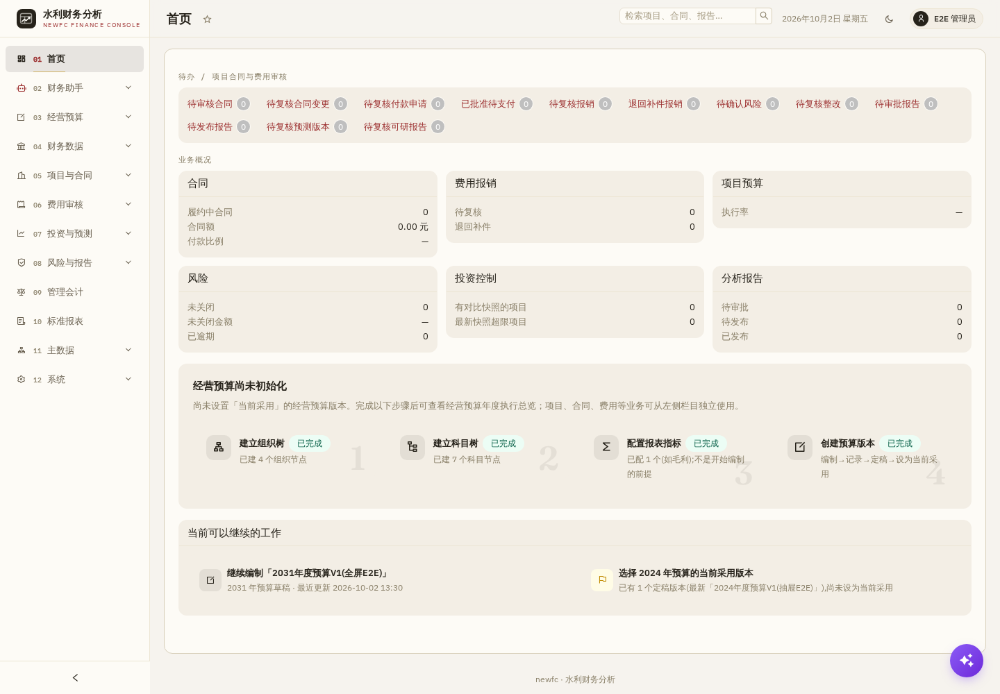

# newfc 水利财务分析

[](https://github.com/chouleilei/newfc/actions/workflows/ci.yml)
[](https://github.com/chouleilei/newfc/releases)

面向水利业务的单机财务分析系统。TypeScript + Express + React/Vite + SQLite，单 Node 进程部署；文件、任务与备份保存在本地，无需 MySQL、Redis、MinIO、Celery、Dify 或 DB-GPT。



## 功能

| 领域 | 功能 |
|---|---|
| 预算 | 经营预算、实际数转换、版本与差异分析、项目预算、计划执行 |
| 财务 | EAS 导入与对账、期间锁定与更正、数据治理、财务报表与趋势、管理会计 |
| 项目与费用 | 项目档案、合同导入与生命周期、变更与付款、费用规则/OCR/模型审核及人工复核 |
| 投资与风险 | 可行性测算、投资控制、财务预测、风险整改、分析报告、冻结导出 |
| 工作台与系统 | 待办、跨域检索、财务助手、任务中心、主数据、用户角色与组织授权、审计、备份恢复 |

金额按整数分存储，新接口以十进制字符串返回；页面、下载、任务和助手按同一服务端权限与组织范围校验。AI 读取同源业务事实，正式写入由业务页面确认。

## 快速开始

需要 **Node 24.21.0**（见 [.nvmrc](.nvmrc)）和 npm。SQLite 驱动含原生模块，安装时必须使用同一 Node 版本；若平台没有预编译包，需要 Python 3、make 和 C/C++ 编译器。

```bash
git clone https://github.com/chouleilei/newfc.git
cd newfc
# 使用 nvm 时：nvm install && nvm use
node --version                         # 应为 v24.21.0
cp .env.example .env                   # 模型配置可留空
cd backend
npm ci
npm run migrate                       # 创建本地空库或显式升级
npm run admin:create:dev -- --username admin --display-name 管理员
npm run dev                           # http://127.0.0.1:3760
```

管理员命令会交互要求输入口令。系统没有默认账号或默认口令。数据默认位于 `backend/data`，不会写入 Git。

在另一个终端启动前端：

```bash
cd newfc/frontend
npm ci
npm run dev                           # http://localhost:5173
```

打开前端地址并用刚创建的账号登录。新库没有业务数据；在页面维护组织、科目和项目后，按各领域模板导入。仓库内的 [财务夹具](backend/tests/fixtures/finance/README.md) 仅供测试，E2E seed 命令会重建专用测试目录，不能用于生产初始化。

## AI 与 OCR（可选）

不配置模型也可以使用业务功能、确定性事实查询和规则审核。模型使用 OpenAI 兼容接口并须支持工具调用；在“系统设置”配置渠道与功能绑定，或按 [.env.example](.env.example) 配置环境变量。OCR 支持同步 JSON 接口和账号登录、上传、轮询、下载的异步协议。

外部服务需要部署者自己的地址和凭据。v0.1.0 已用真实供应商及合成扫描件验证费用完整流程，未评估真实业务单据准确率。模型建议由人工复核，不直接形成正式结论。

## 构建、测试与部署

```bash
(cd backend && npx tsc --noEmit && npm test -- --run && npm run build)
(cd frontend && npm test -- --run && npm run build)
```

生产通过 systemd 运行编译产物，数据库迁移由 `npm run migrate:dist` 显式执行。部署脚本提供测试、构建、迁移前备份、替换和就绪检查；部署前按自己的目录、Node 路径和域名修改模板。具体见 [运维手册](docs/operations-runbook.md) 和 [nginx 示例](deploy/nginx-newfc.example.conf)。

## 文档与版本

- [需求与契约](specs/README.md)、[项目计划](newfc-plan.md)
- [功能覆盖](docs/coverage-matrix.md)、[完成度与后续改进](docs/function-completeness.md)
- [公开版验收摘要](docs/public-release.md)、[验收记录](docs/acceptance-records.md)
- [更新记录](CHANGELOG.md)、[参与开发](CONTRIBUTING.md)、[安全反馈](SECURITY.md)
- [源码与业务规则来源](docs/source-provenance.md)、[第三方声明与许可状态](NOTICE.md)

首个公开版本为 **v0.1.0**，覆盖 26 项功能及 T-0～T-7。财务预测采用受限公式引擎，工作簿在 Excel 中编辑后导入；检索使用关键词/FTS。后续重点为审批浏览器回归、大数据量列表完整性和页面加载性能。公开仓库不包含运行库、生产凭据、真实财务原件或内部运维 QA 原件。

项目源码现已按维护者指示公开；开源许可证尚未选定，不默认授予 MIT 等开源许可中的再分发授权。第三方依赖继续适用各自许可证，见 NOTICE.md。
